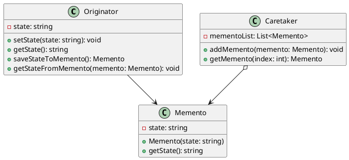
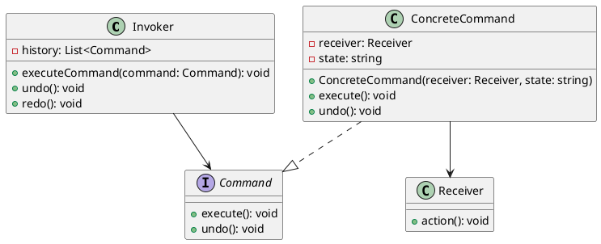

# Ability to Undo an Action

## Problem Statement

Many software applications, particularly those with user interfaces that allow content editing, require the ability to undo actions. This functionality has been a common requirement for UI developers for decades, and several standardized design patterns have been developed to address this problem.

## Suitable Design Patterns

### Memento

* Specifically designed to handle the undo functionality.
* A Memento object internally stores a sequence of snapshots but doesn't reveal those details to the outside world.
* The Memento object provides accessible endpoints related to the functionality required by the originator class, such as an editor.
* These endpoints may include passing a new snapshot into the Memento object, restoring old snapshots, etc.
* Whenever a change is made in a specific object, a new snapshot of this object is created and sent to the Memento object, which appends it to its internal sequence of snapshots.
* The state of the originator can be restored from the history inside the Memento when needed.

#### Why choose the Memento pattern?

1. It allows storing a full history of changes, making it easy to restore any of the snapshots.
2. It uses object-oriented encapsulation effectively.

### Command

* Suitable for undoing and redoing actions.
* To use Command for undo/redo, create a history of Command objects and add the ability to roll back each command.
* Unlike Memento, Command doesn't manage the internal states of the objects, so it may not be suitable when private fields need to have their values changed while undoing an action.
* Commands can be modified to save instructions instead of a collection of actual states, allowing reverting to previous actions by executing opposite actions rather than restoring previous states.
* This approach allows for more efficient memory usage.

#### Why choose the Command pattern instead of the Memento pattern?

1. It allows for more efficient memory usage because it doesn't require storing each individual snapshot.
2. It makes it easier to trace the actual steps taken.

When deciding between the Memento and Command patterns for implementing undo functionality, consider the following factors:

1. If you need to store a complete history of object states and easily restore any of those states, the Memento pattern is a good choice. It encapsulates the state snapshots and provides a clean way to manage the undo/redo operations.

2. If you want to focus on the actions themselves rather than the object states, and you want to optimize memory usage, the Command pattern may be a better fit. By storing the commands and their inverse operations, you can undo and redo actions without keeping a complete history of object states.

Ultimately, the choice between Memento and Command depends on the specific requirements of your application, such as the need for state management, memory constraints, and the desired level of granularity in the undo/redo operations.
