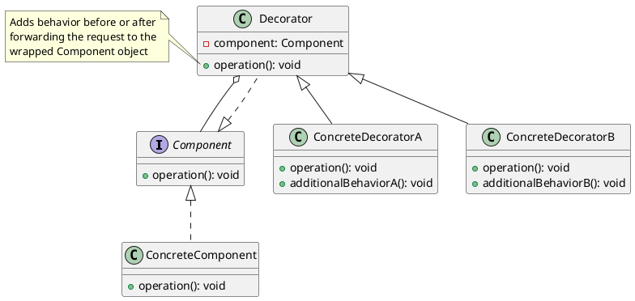

# Adding New Functionality to Existing Objects

## Problem Statement

When working with third-party libraries or legacy code, there may be situations where you need to modify or extend the functionality of existing components without changing their internal code. This could be due to:

- Lack of access to the internal code of the components.
- Restrictions on modifying the components.
- Incompatibility between the external component and your codebase.

In these cases, you need a way to extend the behavior of the objects without directly modifying them.

## Suitable Design Pattern

### Decorator

- Acts as a wrapper around the original object, similar to the Adapter design pattern.
- Uses the same interface as the existing object, maintaining the original API.
- Analogous to a hammer extension on a power drill: the original functionality remains intact while the extension adds new behavior.
- Allows anything in the code that could previously use the original object to use the Decorator class in its place.

#### Why would we want to use the Decorator pattern?

1. Enables easy addition of functionality to objects that can't be modified directly.
2. Enforces the open-closed principle: existing code remains unchanged while new functionality is added through decorators.
3. Allows recursive application of decorators, enabling the addition of multiple functionalities.
4. Supports dynamic addition of responsibilities to an object at runtime.
5. Adheres to the single responsibility principle, as each decorator can be responsible for a single enhanced functionality.

By using the Decorator design pattern, developers can extend the behavior of existing objects without modifying their internal code. This approach provides flexibility and maintainability, as new functionalities can be added or removed by applying or removing decorators, respectively. The Decorator pattern is particularly useful when working with third-party libraries or legacy code that cannot be directly modified.
