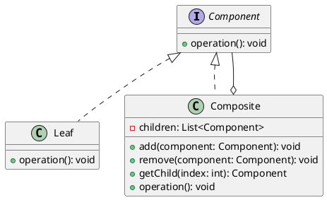

# Building a Complex Object Hierarchy

## Problem Statement

When constructing a structure where objects need to act as containers for similar objects, such as a tree-like data structure or a representation of a file storage system, a suitable design pattern is required to efficiently manage the hierarchy.

## Suitable Design Pattern

### Composite

* Allows the building of tree-like structures efficiently.
* Involves two types of classes: leaf class and composite class.
* Both leaf and composite classes implement the same interface, but the composite class has additional methods.
* A leaf class is the simplest class in the structure and cannot have additional members.
* A composite class can contain a collection of members, including instances of both composite and leaf classes.
* The composite class has methods to manipulate its children, such as Add and Remove.
* Analogous to a file storage structure, where files are leaf objects and folders are composite objects.

#### Why choose the Composite pattern?

1. Provides an easy way to build tree-like structures.
2. Helps distinguish different types of members in the tree structure easily.

The Composite design pattern is particularly useful when dealing with complex object hierarchies, such as representing a file system or building a user interface with nested components. It allows for the uniform treatment of individual objects (leaves) and compositions of objects (composites), making it easier to add new types of components without changing the existing code.

By using the Composite pattern, developers can create flexible and extensible hierarchical structures while maintaining a consistent interface for interacting with the objects in the hierarchy. This pattern promotes code reusability, simplifies the client code, and makes it easier to introduce new types of objects into the hierarchy without modifying the existing codebase.
