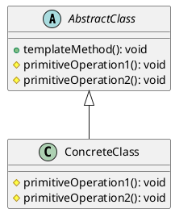
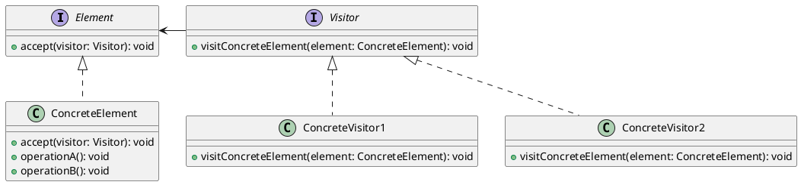
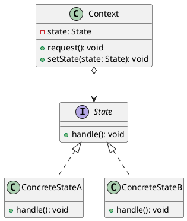
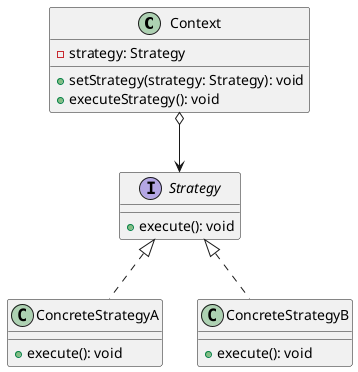

# Creating a Family of Related Algorithms

## Problem Statement

Imagine a scenario where we need to create a family of related algorithms. Each algorithm will have the same parameter types and the same output object type, but will be composed of completely different internal logic.

While we can create many similar methods to achieve this, design patterns offer a better way to approach this problem.

## Suitable Design Patterns

### Template Method

- The Template Method pattern is the simplest way of defining a family of related algorithms.
- It leverages the object-oriented feature of inheritance.
- We define either a skeleton method without implementation or a method with a default algorithm implementation in the base class.
- We inherit from this class and modify the algorithm steps as needed.
- This pattern is suitable for very similar algorithms. Significant alterations to the algorithm behavior might violate the Liskov substitution principle.

#### Why choose the Template Method pattern?

1. It's the easiest way of creating several related algorithms.
2. We can get the clients to only override specific parts of the default algorithm.
3. We can store the bulk of our code in the base class.

### Visitor

- The Visitor pattern allows us to separate algorithms from the objects they operate on.
- We can add new behavior to an object without having to change the object itself.
- The Visitor class operates on an object but is separate from it.
- We can define different visitors to apply different algorithms to our object.
- The Visitor class needs to be able to "visit" the object and access its accessible members.

#### Why choose the Visitor pattern?

1. It separates the algorithms from the objects they operate on, enforcing the single responsibility principle.
2. It can add any new behavior to an object without changing it.
3. It can have different sets of behaviors that can be applied to objects.
4. The Visitor class can accumulate useful information about an object by visiting it.

### State

- The State pattern makes an object change its behavior when its internal state changes.
- It can include state transition logic, allowing undo and redo actions.
- The State pattern can be used in conjunction with the Memento pattern.

#### Why choose the State pattern?

1. It separates object behaviors from the object, enforcing the single responsibility principle.
2. It allows us to implement state transition logic.
3. It allows us to introduce new behaviors to an object easily without violating the open-closed principle.

### Strategy

- The Strategy pattern is intended to be used inside a specific set of conditional logic.
- It defines a series of related algorithms.
- All strategy objects within the same set implement the same interface.

When creating a family of related algorithms, consider the following factors to choose the most suitable design pattern:

1. **Similarity of Algorithms**: If the algorithms are very similar and only require minor variations, the Template Method pattern can be a good choice. It allows you to define a common algorithm structure in the base class and let subclasses override specific steps.

2. **Separating Algorithms from Objects**: If you want to add new behaviors to an object without modifying the object itself, the Visitor pattern can be helpful. It allows you to define separate visitor classes that encapsulate the algorithms and can operate on the object.

3. **Behavior Based on Internal State**: If an object's behavior needs to change based on its internal state, the State pattern can be used. It encapsulates the different behaviors into separate state classes and allows the object to switch between states dynamically.

4. **Interchangeable Algorithms**: If you have a set of interchangeable algorithms that can be selected dynamically at runtime, the Strategy pattern can be a good fit. It defines a family of algorithms, encapsulates each one, and makes them interchangeable within a specific context.

By understanding the characteristics and benefits of each design pattern, you can make an informed decision on which pattern to use based on the specific requirements and constraints of your problem.

Remember that design patterns are not mutually exclusive, and you can often combine them to achieve the desired behavior and structure in your code. The key is to identify the core problem you are trying to solve and select the pattern(s) that best address that problem while promoting code reusability, flexibility, and maintainability.
