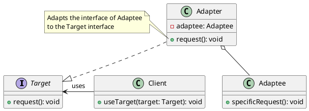

# Dealing with Incompatible Code Structures

## Problem Statement

When working with third-party libraries or legacy code, compatibility issues may arise:

- Data format mismatch: The third-party library returns data in a format (e.g., XML) that is incompatible with the rest of the application (e.g., JSON).
- Interface mismatch: The third-party library's accessible interface is written differently from how the related functionality is written in the application.
- Legacy code: Older code within the system may have been written using different philosophies or practices, making it difficult to change without affecting other components.

In these situations, making changes to the existing codebase to accommodate the incompatible components is undesirable.

## Suitable Design Pattern

### Adapter

- Acts as a wrapper class for the incompatible component, allowing it to be used in the existing codebase.
- Provides an interface that is compatible with the rest of the code while internally calling methods on the external component.
- Handles data format conversion, if necessary, to ensure compatibility with the rest of the codebase.
- Analogous to a real-life physical adapter, such as an electric socket plug adapter.

#### Why choose the Adapter pattern?

- Isolates interface conversion functionality to a single place in the code.
- Enforces the open-closed principle: existing code remains unchanged while new functionality is added through the adapter.
- Standardizes the access point to the immutable external component, aligning it with the rest of the code.

By using the Adapter design pattern, developers can effectively integrate incompatible components into their codebase without modifying the existing code. The adapter acts as a bridge between the client code and the incompatible component, providing a seamless interface that adheres to the application's standards and practices.
