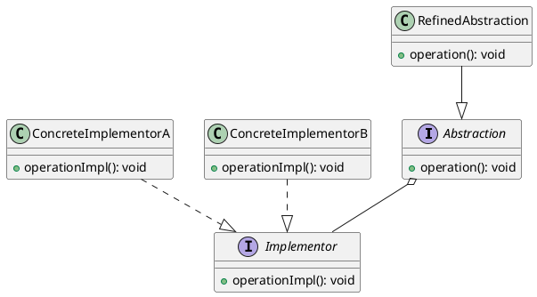

# Developing a Multitier Application

## Problem Statement

In a scenario where two separate teams are working on an application:

- Front-end specialists focus on creating a beautiful user interface.
- Back-end specialists excel at writing business logic.

The goal is to make the user interface compatible with different types of backends, such as different operating systems or data storage technologies.

## Suitable Design Patterns

### Bridge

- Allows the development of two parts of an application independently.
- The user interface is known as the "interface," while the back-end business logic is known as the "implementation."
- Designed upfront, with agreed-upon communication between the interface and implementation.
- Enables the swapping of implementations as long as the access points match the interface's expectations.
- Suitable for scenarios with different implementations for various operating systems or data storage technologies.

#### Why choose the Bridge pattern?

1. Enables independent development of user interface and business logic.
2. Allows easy plugging of the user interface into different backends with matching access point signatures.
3. Separates the implementation details of business logic from the user interface team.
4. Enforces the open-closed principle.
5. Adheres to the single responsibility principle.

### Facade

- Suitable when the backend of the app is accessed via a complex mechanism, such as WSDL with auto-generated code.
- Abstracts away the complex implementation details of the communication mechanism.
- Applicable when the business logic layer is hosted by a third party or when the business logic and UI applications can't be designed together upfront.

#### Why choose the Facade pattern instead of the Bridge pattern?

1. Easier to implement when the service with the business logic is hosted by a third party.
2. More suitable when the interface and the implementation can't be designed upfront.

### Proxy

- Useful for relatively simple applications.
- Provides simplified representations of back-end classes for UI components to interact with.
- Allows interchangeable implementations of back-end classes that the same proxies can handle.
- Suitable when the back-end service with the business logic is expected to be modified and redeployed frequently.
- Beneficial when triggering the actual business logic is computationally expensive.

#### Why choose the Proxy pattern instead of the Bridge pattern?

1. Ensures no outage of user-accessible functionality during back-end redeployment.
2. Performs better when the business logic is computationally expensive.

When developing a multitier application with separate user interface and business logic teams, the Bridge, Facade, and Proxy design patterns offer different approaches to handle the separation and communication between the two tiers. The choice of pattern depends on factors such as the level of independence required, the complexity of the backend, the hosting environment, and performance considerations.
