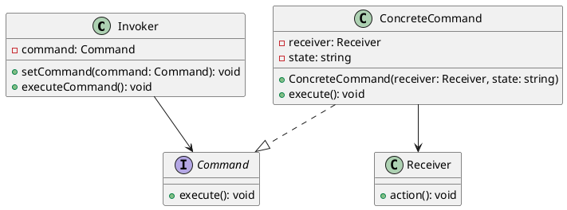

# Encapsulating Complex Operations

## Problem Statement

In some systems, internal components need to accept requests with instructions to perform certain actions. As the system evolves, the structure of these requests can become more complex, leading to situations where different objects end up executing very similar actions but with completely different sets of inputs.

This complexity can cause issues in the code, such as reduced readability. For example, if different object types execute the same action, we may put this action into a base class that all these objects inherit from. However, if those objects are totally different, having them inherit from the same base type might not be appropriate. Additionally, if there is a large variety of such objects, we may end up with numerous base classes.

The goal is to standardize the requests to simplify the system and improve code maintainability.

## Suitable Design Patterns

### Command

- The request is embedded in the class that executes a particular action, known as a Command.
- The Command class contains a single method, usually called `Execute()`.
- None of the objects are responsible for generating the request; once a Command is created, it can be executed from any object.
- The Command object has the sole responsibility of executing the action, while the calling objects only need to call its `Execute()` method.
- A Command object can have complex data modification logic that can be altered by its input parameters.
- Instead of having multiple pieces of similar update logic in the codebase, a single Command object can be slightly modified by the input parameters passed into it.
- The `Execute()` method usually comes with no parameters (except for a cancellation token, if needed).
- Unique values can be populated in the Command class by passing them into its constructor when the Command object is created.

#### Why choose the Command pattern?

1. It separates the request from the objects making them, enforcing the Single Responsibility Principle.
2. It standardizes instructions across the application.
3. It has the ability to implement undo/redo actions.
4. It has the ability to assemble simple instructions into complex ones.
5. It makes it easy to schedule instructions.

When dealing with complex combinations of inputs that control the system, the Command pattern provides a way to encapsulate the request and its associated actions into a separate object. This promotes a cleaner separation of concerns, improves code readability, and allows for more flexibility in handling different variations of the request.

By using the Command pattern, the system can standardize the way requests are handled, regardless of the complexity of the inputs. This standardization simplifies the overall design and makes it easier to maintain and extend the system over time.

Additionally, the Command pattern enables advanced features such as undo/redo functionality, the ability to compose simple commands into more complex ones, and the scheduling of commands for later execution.

Overall, when faced with complex operations that are controlled by various combinations of inputs, the Command pattern offers a structured and maintainable approach to encapsulate and manage these operations effectively.
