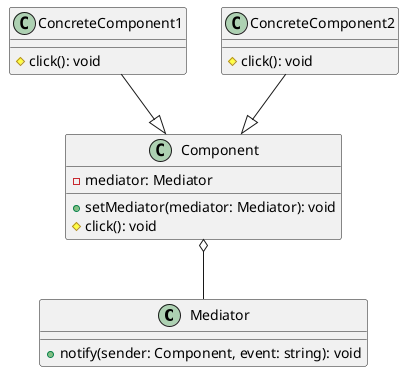
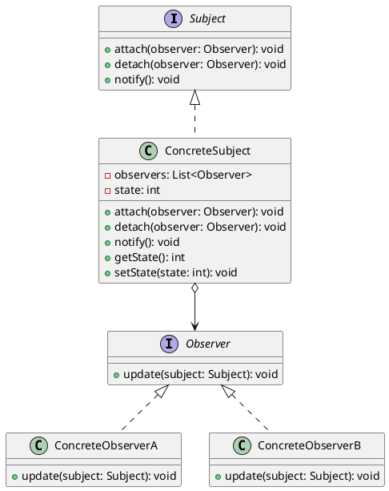

# Facilitating Communication Between Objects

## Problem Statement

When dealing with a container object that contains other objects of various types, such as a user interface with components like text boxes, buttons, and labels, certain objects need to emit events that can affect other objects. For example, clicking a button should be able to change the text on specific labels.

Connecting the components directly to each other can lead to excessively complex code, especially when many elements inside the container need to be connected in arbitrary many-to-many relationships.

## Suitable Design Patterns

### Mediator

- A class that acts as a communication medium between objects when they don't have a way of communicating with each other directly.
- Analogous to air traffic control, where airplanes don't communicate directly with each other, but rather through the control tower.
- In the user interface example, the background layout itself can act as a mediator.
- When any of the controls on the layout emits a specific type of event, the layout class decides whether this event is relevant to any other element and notifies that element accordingly.
- The sole responsibility of deciding what to do with the event lies with the Mediator class.

#### Why choose the Mediator pattern?

1. The sole responsibility of facilitating communication between different objects is taken up by a single class.
2. Individual components are much easier to reuse.
3. The Open-Closed Principle is easy to enforce.

### Observer

- Utilizes the concept of publishing and subscribing.
- Objects that emit a specific event are publishers, and objects that need to react to the event are subscribers.
- An object can subscribe to specific event types or events with specific data values.
- Subscriptions can be added or removed as needed.
- An object can be both a publisher and a subscriber, and can handle multiple event types.

#### Why choose the Observer pattern?

1. Easily establish relationships between objects at runtime.
2. Facilitates the enforcement of the Open-Closed Principle.
3. Can be implemented across application boundaries.

When multiple object instances of different types need to communicate, the Mediator and Observer patterns provide effective solutions. The Mediator pattern centralizes the communication logic into a single class, making it easier to manage and maintain the relationships between objects. The Observer pattern allows objects to subscribe and react to specific events, enabling loose coupling and flexibility in the communication process.

Choosing between the Mediator and Observer patterns depends on the specific requirements of the system. The Mediator pattern is suitable when a centralized control is needed to coordinate the interactions between objects, while the Observer pattern is more appropriate when objects need to be notified of specific events without tight coupling between the publisher and subscriber objects.
