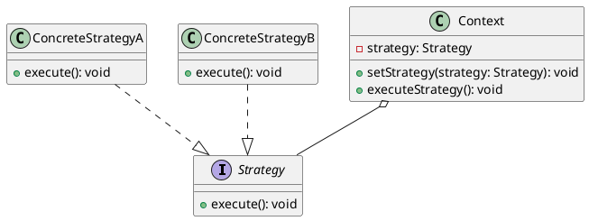

# Implementing Complex Conditional Logic

## Problem Statement

When implementing complex conditional logic, such as a switch statement with several cases or an if-else logic with multiple conditions, the traditional approach of writing specific code under each condition can lead to the following issues:

- Reduced code readability and maintainability.
- Difficulty in writing unit tests for methods with complex conditional logic.
- Violation of SOLID principles, particularly the Single Responsibility Principle, as the method becomes responsible for both making conditional decisions and executing different types of logic based on those decisions.

## Suitable Design Patterns

### Strategy

- Provides a container object (Context) that contains a specific interface (Strategy).
- Strategy is any class that implements the interface defined by the Context.
- The implementation of the Strategy object inside the Context object is assigned dynamically, allowing for easy replacement.
- The Strategy object has one core action method defined on the interface, and the Context object has a wrapper method with a similar signature that calls the action method on the current Strategy implementation.
- Multiple Strategy implementations are created, each containing its own version of the action method.
- When dealing with multi-condition logic, the appropriate Strategy implementation is passed into the Context class under each condition.

#### Why choose the Strategy pattern?

1. Isolates specific conditional behavior into its own method.
2. Enforces the Single Responsibility Principle by making the code with conditional statements solely responsible for outlining the conditions.
3. Facilitates writing unit tests against code with complex conditional logic.

### Difference between the Strategy and Factory Method design patterns

- The Factory Method pattern is used for generating a long-lived object that can execute its own logic outside of the factory method, while the Strategy pattern is used for executing a particular behavior or returning a short-lived simple data object.
- The Strategy pattern is suitable when the decision on which implementation to use is made at request time, while the Factory Method pattern is appropriate when the decision is made at configuration time.

### Abstract Factory

- A collection of related factory methods.
- Applicable in the same way as a Factory Method, but only when a group of associated objects is needed rather than a single object.

When dealing with complex conditional logic, the Strategy pattern provides a clean and maintainable approach by encapsulating each behavior into its own class and allowing the context to switch between them dynamically. This promotes code reusability, improves testability, and adheres to the Single Responsibility Principle.

The Factory Method and Abstract Factory patterns are more suitable when the focus is on object creation rather than behavior execution, with the Factory Method generating a single object and the Abstract Factory creating a family of related objects based on certain conditions.
