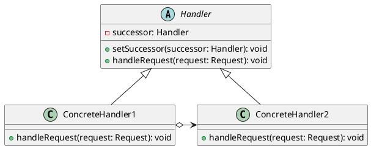
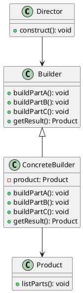

# Multistage Processing

## Problem Statement

When implementing logic that requires multiple stages of processing, possibly involving conditional logic, we need a way to handle the flow of execution effectively. One example of this is the validation of HTTP requests, where we might want to check the following:

1. Whether the incoming request matches any allowed paths in our application.
2. Whether the user is authenticated.
3. Whether the user is allowed to access the particular resource that the request was made for.

In such situations, we might want to short-circuit the flow as soon as we encounter a condition that wouldn't allow the request to proceed any further. For example, if the request was made to a non-existent path, there's no point in checking the user's credentials, and returning a 404 page would be sufficient.

## Suitable Design Patterns

### Chain of Responsibility

* The logic is arranged into a chain of individual components.
* Each component has a condition that decides whether to move on to the next component or short-circuit the logic.
* An example of this is the ASP.NET Core Middleware pipeline, which is designed for request validation.

#### Why choose the Chain of Responsibility pattern?

1. It allows control over the order of multistage processing.
2. The process can be stopped at any time if moving on doesn't make sense.
3. Each component in the chain is responsible for a specific stage of processing, making it easy to enforce the Single Responsibility Principle.
4. It's suitable for scenarios where a one-off logical flow needs to be executed.

### Builder

* Allows the building of an object step by step.
* If a Builder implementation is put through a multistage conditional logic, it will have a different end product for each unique combination of conditions.
* Unlike the Chain of Responsibility, Builder doesn't have to work with specific steps done in a specific order.
* An example is the StringBuilder in C#, which allows arbitrary logic to be applied to build a string.

#### Why choose the Builder pattern instead of the Chain of Responsibility pattern?

1. It's easier to implement when the order of the processing steps doesn't need to be exact.
2. It's suitable for scenarios where a reusable object needs to be built.

When dealing with multistage processing, the Chain of Responsibility pattern is most suitable when there is a specific order of steps that need to be followed, and the process can be short-circuited based on certain conditions. On the other hand, the Builder pattern is more appropriate when the order of the processing steps is not strict, and the goal is to build a reusable object through a series of steps.

Choosing between the Chain of Responsibility and Builder patterns depends on the specific requirements of the system. If the focus is on executing a one-off logical flow with the ability to stop the process at any stage, the Chain of Responsibility pattern is the better choice. If the goal is to construct a reusable object through a series of steps without a strict order, the Builder pattern is more suitable.
