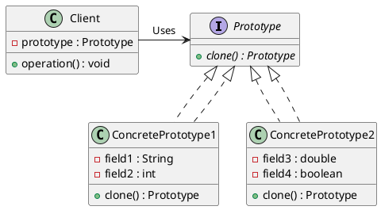

# Replicating Complex Objects

## Problem Statement

* Need to copy an object that is not a primitive type multiple times

* Complex objects with many fields, some containing other objects
* Private fields that need to be copied but can't be accessed directly
* Writing complex code to copy objects adds complexity, reduces readability, and is error-prone
* No direct access to private members may result in an inexact copy and undesirable side effects

## Suitable Design Patterns

### Prototype

* Design pattern created specifically for this problem

* Makes complex objects cloneable
* Defines an interface with a method (usually `Clone()`) that produces an instance of an object implementing the interface
* To make an object cloneable, implement the interface when defining the object type
* Inside the `Clone()` method, copy the value of every field into the output object
* Advantages:
  * Single place in the codebase to copy objects, easier to consider all edge cases
  * Full access to private members, ensuring an exact copy

#### Why would we want to use the Prototype pattern?

* All code to copy complex objects is located in one place

* Enables copying of private members of the object
* Any code that needs to generate a copy of the object only needs to call the `Clone()` method without worrying about the details of the cloning process
