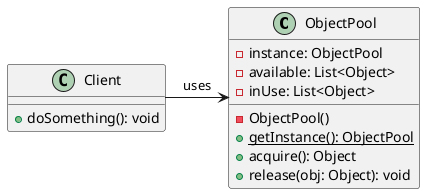

# Reusing the Same Object Instance

## Problem Statement

When an application requires using exactly the same object instance throughout the entire codebase, regardless of whether the classes that use it can communicate directly with each other, some challenges arise:

* Instantiating the object in one place and passing the instance to every class can lead to extra code that is hard to read and maintain.
* There's no guarantee that a different object reference won't be passed into a class that uses it, potentially introducing bugs.

## Suitable Design Patterns

### Singleton

* The class that should have a single instance will have a static method that returns an instance of the class.
* The static method calls a private constructor the first time it is called, ensuring the class is instantiated only once.
* Subsequent calls to the static method return the same instance that was instantiated earlier.
* The class has no public constructor, preventing external code from creating new instances.
* Guarantees that the same instance of the class is returned, regardless of where the static method is called from.

```plantuml
@startuml
class Singleton {
  - instance: Singleton
  - Singleton()
  + {static} getInstance(): Singleton
}

note left of Singleton::"- Singleton()"
  Private constructor to prevent
  direct instantiation
end note

note left of Singleton::"{static} getInstance()"
  Returns the single instance of
  the Singleton class
end note
@enduml
```

#### Why choose the Singleton pattern?

* Allows using the same instance of an object in any part of the application without explicitly passing an instantiated object.
* Prevents creating more than one instance of a particular type, which is useful for controlling access to shared resources.

### A Design Pattern Relying on the Singleton Pattern: Object Pool

* The Object Pool design pattern is primarily intended for managing multiple instances of the same object type without much performance penalty.
* To be accessible throughout the application, the Object Pool also needs to be a singleton.
* The class that acts as an Object Pool should implement the Singleton design pattern.

#### Why would we implement the Object Pool design pattern as the Singleton pattern?

* The entire application shares the same pool of objects.
* It ensures that no more object instances than strictly needed are instantiated.

By using the Singleton design pattern, developers can ensure that the same instance of an object is used throughout the application, avoiding the need to pass instances explicitly and preventing the creation of multiple instances when only one is required. The Object Pool design pattern, when implemented as a Singleton, allows for efficient management of object instances while maintaining a single pool accessible from any part of the codebase.
