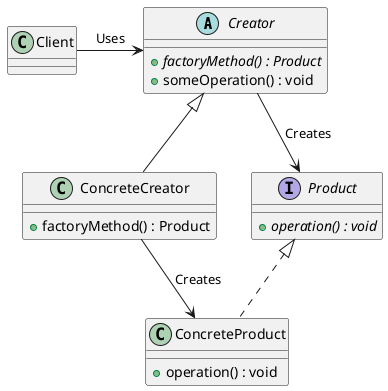
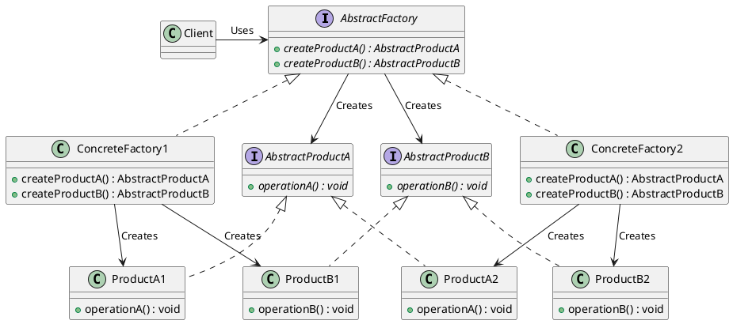
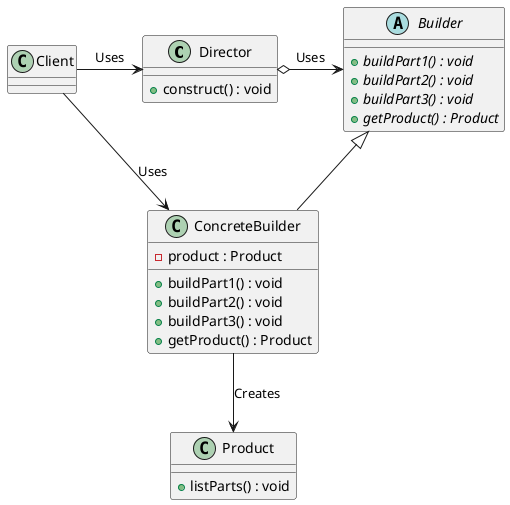

# Design Patterns for Selecting Object Implementations at Runtime

## Problem Statement

* Code uses a particular object type but only needs to know the interface, not the concrete implementation

* Concrete implementation may need to be chosen dynamically at runtime based on conditions

* **Example**: Audio player app that works on both Windows and Linux, which have different audio architectures

## Suitable Design Patterns

### 1. Factory Method

* A method in a Creator object that returns an object implementing a particular interface
* Several variations of Creator, each returning a specific implementation based on conditions
* Benefits: Single responsibility principle, easy to extend, facilitates unit testing

### 2. Abstract Factory

* Uses multiple factory methods in Creator to create a family of related objects
* Example: App plays both audio and video on Windows and Linux
* Separate methods for each interface, with Windows and Linux-specific versions
* Implements interface or extends abstract class, with concrete implementations creating relevant output objects

### 3. Builder

* Similar to Factory Method but builds the object step by step
* Single concrete implementation (shell object) with parameters/dependencies injected based on conditions
* Two main components:
  * Builder: Class with methods to modify object before returning
  * Director: Class with methods that accept Builder, call its methods with parameters, return finished object
* Used to gradually build complex objects and provide different representations
* Benefits: Single responsibility principle, facilitates unit testing, no need for class variations, adjusts properties through conditional logic, code reuse

