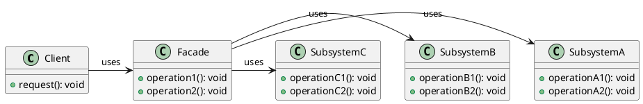
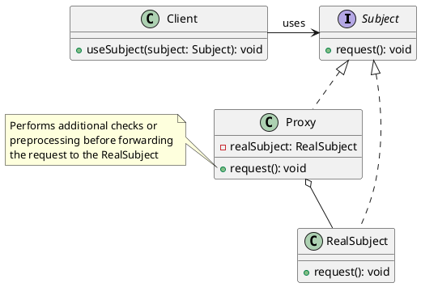

# Simplifying Complex Back-End Logic

## Problem Statement

In a multilayer architecture, accessing complex back-end logic from the presentation layer can be challenging due to:

* Multiple classes retrieving data from different sources (e.g., databases, external services).
* Auto-generated classes that are difficult to abstract.
* Frequently updated complex classes requiring constant reference updates.
* Expensive operations that need to be accessed frequently.

Directly using these complex classes from the presentation layer can lead to tight coupling, violate the dependency inversion principle, and make the system harder to maintain.

## Suitable Design Patterns

### Facade

* Provides a simplified interface to a set of complex objects.
* Acts as a wrapper around several complex classes, encapsulating their interactions.
* Shields other system components from direct interaction with complex logic.
* Centralizes updates to the complex subsystem logic within the Facade object.

#### Why choose the Facade pattern?

1. Simplifies access to a complex subset of the system.
2. Shields other application components from interacting with complex logic.
3. Centralizes updates to the complex subsystem logic, reducing the risk of bugs.

### Proxy

* Wraps a class with the same access interface, making them interchangeable.
* Restricts access to the original class based on specific conditions or roles.
* Implements preprocessing of requests before accessing the original class.
* Suitable for optimizing access to data that rarely changes or is expensive to obtain.

#### Why choose the Proxy pattern?

1. Abstracts away complex implementation details of accessing a particular class.
2. Applies additional request validation before accessing a class.
3. Optimizes performance by accessing the actual class only when necessary.

By using the Facade and Proxy design patterns, developers can simplify the access to complex back-end logic from the presentation layer. The Facade pattern provides a unified interface to a set of complex classes, while the Proxy pattern adds an extra layer of control and optimization when accessing specific classes. These patterns help improve maintainability, reduce coupling, and enhance the overall system architecture.
