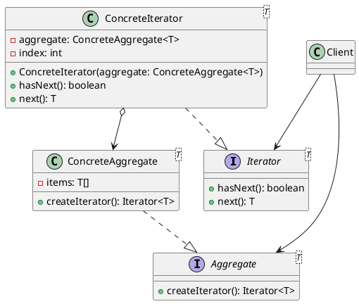

# Traversing Complex Collections

## Problem Statement

In some scenarios, we may have a complex data structure due to various constraints that need to be overcome. For example, we might need to arrange the data into a binary search tree to enable an efficient search algorithm, or we might have a linked list where each item in the collection needs to know about the next item.

Regardless of the internal structure and algorithms used, the client class that will be using our library shouldn't be concerned with these details. The client should only care about being able to work with the data in our collection.

## Suitable Design Pattern

### Iterator

- The Iterator design pattern hides the implementation details of a collection-manipulating algorithm.
- It exposes basic methods that enable any external object to work with the collection, such as `MoveNext()` and `HasMore()`.
- From the client's perspective, the collection appears as sequential flat data, similar to an array, regardless of its actual internal structure.
- Most modern programming languages have core libraries that provide a range of collection types with built-in iterators.
- However, there may still be scenarios where we need to write a particular kind of collection ourselves, and this is where the Iterator pattern becomes very useful.

#### Why choose the Iterator pattern?

1. It abstracts away the complex implementation details of collection management.
2. It simplifies the view of the collection for the client.

The Iterator pattern provides a way to traverse a collection without exposing its internal structure. It defines a separate object, called an iterator, that encapsulates the traversal logic. The iterator provides a standard interface for accessing the elements of the collection sequentially, without the client needing to know how the collection is implemented.

By using the Iterator pattern, we can achieve the following benefits:

1. **Encapsulation**: The internal structure and traversal logic of the collection are encapsulated within the iterator, hiding the complexity from the client.

2. **Flexibility**: The collection can change its internal structure without affecting the client code, as long as it provides an iterator that adheres to the expected interface.

3. **Reusability**: The traversal logic is separated from the collection itself, allowing the same traversal algorithm to be used with different collections.

4. **Simplicity**: The client code can focus on working with the elements of the collection, without worrying about the details of how the elements are stored or accessed.

When dealing with complex collections, the Iterator pattern provides a clean and flexible way to traverse the elements without coupling the client code to the specific implementation of the collection. It promotes a more modular and maintainable design, as the collection and its traversal logic can evolve independently.

By leveraging the Iterator pattern, we can write code that is more robust, extensible, and easier to understand, as the client can work with the collection through a simple and standardized interface, regardless of the underlying complexity.
