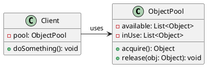
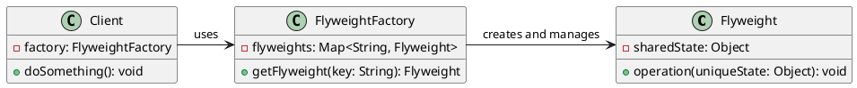
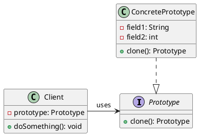

# Using Large Numbers of Objects Efficiently

## Problem Statement

When an application requires the use of many similar objects, instantiating and destroying them frequently can lead to performance issues:

- Instantiating objects is a relatively expensive process, requiring memory allocation and initialization
- Using similar objects in different parts of the application requires allocating memory for each instance
- Running complex constructor logic for each object instantiation can have a significant performance impact
- Garbage collection or manual memory management can introduce additional performance costs and complexity

## Suitable Design Patterns

### Object Pool

- Allows reuse of object instances to avoid instantiating new objects every time
- Uses a single Pool object to store multiple instances of a specific object type
- Objects that aren't being used are stored inside the pool
- When an object is requested, it becomes unavailable to other parts of the code
- Once the caller finishes with the object, it is returned to the pool for reuse
- Limits the pool size and determines which object instances to keep or discard

#### Why choose the Object Pool pattern?

- Reuses objects to avoid performance penalties associated with instantiating new objects
- Maintains the pool size as needed to prevent having more object instances than necessary

### Flyweight

- Allows multiple objects to share parts of their state
- If many objects have the same values for certain attributes, those attributes can be moved to a separate object
- All instances refer to the shared object, reducing memory usage
- Useful when supporting systems where performance would significantly decrease otherwise

#### Why choose the Flyweight pattern?

- Allows storing more information in memory than would be possible otherwise
- Makes the code more complicated, requiring careful consideration of shared and unique state

### Prototype

- Enables creating many similar objects without defining their field values each time
- Useful when objects in the object pool are complex
- Can be combined with Object Pool to gain performance benefits
- Involves cloning an existing object and modifying only the necessary properties

#### Why choose Prototype alongside Object Pool?

- Objects in the pool are easier to instantiate through cloning

By utilizing these design patterns, developers can achieve efficiency when working with a large number of object instances, improving application performance and memory usage.
