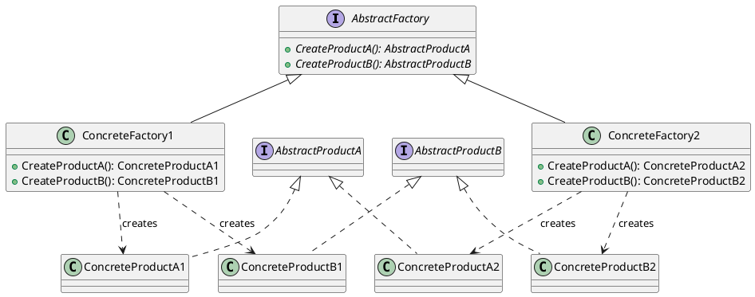
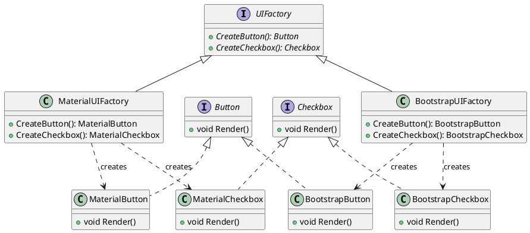

# Abstract Factory

The Abstract Factory pattern is a creational design pattern that provides an interface for creating families of related or dependent objects without specifying their concrete classes. It encapsulates the creation of objects into a separate factory class, allowing for the creation of different families of objects based on a common interface.

* The **Abstract Factory** interface declares a set of creation methods for each of the abstract products.
* **Concrete Factories** implement the creation methods declared in the Abstract Factory interface, creating and returning concrete product objects.
* **Abstract Products** are interfaces or abstract classes that define the types of objects to be created by the factory methods.
* **Concrete Products** are the specific implementations of the abstract products, created by the corresponding concrete factories.
* The **Client** code works with the abstract factory and products through their interfaces, allowing for the creation of families of related objects without being coupled to their concrete classes.



## Benefits

The Abstract Factory pattern offers several benefits that are similar to those of the Factory Method pattern:

1. **Single Responsibility Principle**: The Abstract Factory pattern separates the conditional logic from the implementation of the logic inside each condition. 
2. **Improved Testability**: By separating the conditional logic, the Abstract Factory pattern allows for the creation of simple and readable automated tests. Instead of complex tests assessing intricate conditional logic, simple scenarios can be used to verify that the correct implementations of Target Objects and Factory are selected for each condition. Separate sets of scenarios can be applied to each Target Object and Factory implementation.
3. **Reusability**: The Abstract Factory pattern enables the execution of a particular condition once. Since all implementations of each Target Object type use a common abstraction, a concrete implementation can be created once and reused throughout the codebase.
4. **Creation of Related Objects**: One of the major benefits of the Abstract Factory pattern is its ability to create a whole family of related objects in one go. This is particularly useful when dealing with complex systems that require the creation of multiple related objects.

## Caveats

1. **Not Suitable for Step-by-Step Object Creation**: The Abstract Factory pattern is designed to create a family of related objects in one go. However, it may not be the best choice when the object creation process requires a step-by-step approach. In such cases, the Builder pattern may be more appropriate.

2. **Increased Complexity**: Implementing the Abstract Factory pattern can introduce additional complexity to the codebase, especially when dealing with a large number of product families and concrete classes. This complexity can make the code harder to understand and maintain.

3. **Rigidity in Adding New Products**: Adding new products to an existing Abstract Factory implementation may require modifying the abstract factory interface and all its concrete implementations. This can be a drawback in terms of flexibility and extensibility.

## Example



In this example, we have a UI component system that uses the Abstract Factory pattern to create different families of UI components (Material UI and Bootstrap).

1. The `UIFactory` interface declares the factory methods `CreateButton` and `CreateCheckbox` for creating button and checkbox components.
2. The `MaterialUIFactory` and `BootstrapUIFactory` classes are concrete factories that implement the `UIFactory` interface and provide specific implementations for creating Material UI and Bootstrap components, respectively.
3. The `Button` and `Checkbox` interfaces define the common operations for button and checkbox components.
4. The `MaterialButton`, `BootstrapButton`, `MaterialCheckbox`, and `BootstrapCheckbox` classes are concrete products that implement the corresponding interfaces and provide specific implementations for rendering the components.
5. The client code can work with the abstract factory and product interfaces, allowing for the creation of families of related UI components without being coupled to their concrete classes.


```cs
// Usage
class Program
{
    static void Main(string[] args)
    {
        IUIFactory materialUIFactory = new MaterialUIFactory();
        Client materialUIClient = new Client(materialUIFactory);
        materialUIClient.RenderUI();

        IUIFactory bootstrapUIFactory = new BootstrapUIFactory();
        Client bootstrapUIClient = new Client(bootstrapUIFactory);
        bootstrapUIClient.RenderUI();
    }
}
```

In this code, we demonstrate the usage of the Abstract Factory pattern by creating instances of MaterialUIFactory and BootstrapUIFactory, passing them to the Client instances, and rendering the UI components.
