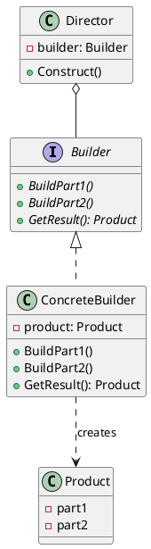
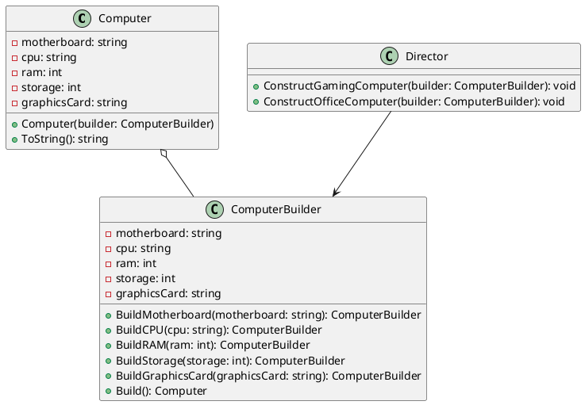

# Builder Design Pattern

The Builder design pattern is a creational pattern that separates the construction of a complex object from its representation, allowing the same construction process to create different representations. It provides a way to build complex objects step by step, making the construction process more flexible and maintainable.

## Structure

The Builder pattern consists of the following components:

1. **Builder**: An interface or abstract class that defines the steps to build the complex object.
2. **Concrete Builder**: Implements the Builder interface and provides a specific implementation for building the complex object.
3. **Director**: Constructs the complex object using the Builder interface.
4. **Product**: Represents the complex object being built.



## Benefits

1. **Encapsulation**: The Builder pattern encapsulates the construction logic of a complex object, separating it from the object's representation. This separation allows for better organization and maintainability of the codebase.

2. **Flexibility**: The pattern allows for the creation of different representations of the complex object using the same construction process. This flexibility enables the addition of new builders without modifying the existing code.

3. **Simplified Construction**: The Builder pattern simplifies the construction of complex objects by providing a step-by-step approach. Each step can be implemented independently, making the construction process more manageable and easier to understand.

4. **Improved Readability**: By using the Builder pattern, the code becomes more readable and self-explanatory. The construction process is broken down into smaller, focused steps, making it easier to understand the purpose and functionality of each step.

## Caveats

1. **Increased Complexity**: Implementing the Builder pattern can introduce additional complexity to the codebase, especially when dealing with simple objects that don't require a step-by-step construction process. It's important to consider the complexity of the objects being built and weigh the benefits against the added complexity.

2. **Overhead**: The pattern may introduce some overhead in terms of the number of classes and objects involved. This overhead can be justified when building complex objects but may not be necessary for simpler objects. It's important to assess whether the added flexibility and maintainability provided by the Builder pattern outweigh the overhead in a given scenario.

3. **Learning Curve**: Developers unfamiliar with the Builder pattern may need some time to understand and effectively apply the pattern in their codebase. Proper documentation and examples can help mitigate this learning curve.

## When to Use

The Builder pattern is most beneficial in the following scenarios:

1. **Complex Objects**: When dealing with objects that have many parts or require a complex construction process, the Builder pattern provides a structured approach to building these objects step by step.

2. **Multiple Representations**: If an object can have multiple representations or configurations, the Builder pattern allows for the creation of different variations using the same construction process.

3. **Encapsulation of Construction**: When the construction logic needs to be separated from the object's representation for better code organization and maintainability.

However, the Builder pattern may not be necessary for simple objects that don't require a step-by-step construction process. In such cases, using a simpler approach, like a constructor or a factory method, may be more appropriate.

## Example

Let's consider an example of building different types of reports using the Builder pattern.



In this example, we have the following components:

1. **Computer**: The final product class that represents a computer. It has properties such as motherboard, CPU, RAM, storage, and graphics card.
2. **ComputerBuilder**: The builder class that provides methods to build different parts of the computer. It has methods like BuildMotherboard(), BuildCPU(), BuildRAM(), BuildStorage(), and BuildGraphicsCard() that allow setting the respective components. The Build() method returns the final constructed computer object.
3. **Director**: The director class that defines the construction process for different types of computers. It has methods like ConstructGamingComputer() and ConstructOfficeComputer() that take a builder instance and use it to construct a specific configuration of the computer.

Here's a code snippet illustrating the usage of the Builder pattern in this example:

```cs
// Create an instance of the ComputerBuilder
ComputerBuilder builder = new ComputerBuilder();

// Create an instance of the Director
Director director = new Director();

// Construct a gaming computer
director.ConstructGamingComputer(builder);
Computer gamingComputer = builder.Build();
Console.WriteLine("Gaming Computer:\n" + gamingComputer.ToString());

// Construct an office computer
director.ConstructOfficeComputer(builder);
Computer officeComputer = builder.Build();
Console.WriteLine("Office Computer:\n" + officeComputer.ToString());
```
