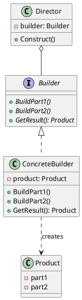
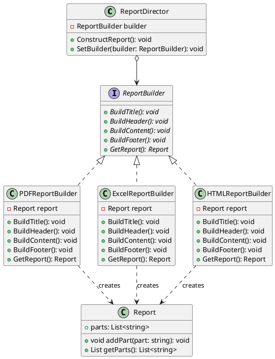

# Builder Design Pattern

The Builder design pattern is a creational pattern that separates the construction of a complex object from its representation, allowing the same construction process to create different representations. It provides a way to build complex objects step by step, making the construction process more flexible and maintainable.



## Benefits

1. **Encapsulation**: The Builder pattern encapsulates the construction logic of a complex object, separating it from the object's representation.
   * This separation allows for better organization and maintainability of the codebase.
   * The construction process can be modified or extended without affecting the object's representation.

2. **Flexibility**: The pattern allows for the creation of different representations of the complex object using the same construction process.
   * Different builders can be implemented to create variations of the complex object.
   * New builders can be added without modifying the existing code.

3. **Simplified Construction**: The Builder pattern simplifies the construction of complex objects by providing a step-by-step approach.
   * Each step of the construction process can be implemented independently.
   * The construction process becomes more manageable and easier to understand.

4. **Improved Readability**: By using the Builder pattern, the code becomes more readable and self-explanatory.
   * The construction process is broken down into smaller, focused steps.
   * The purpose and functionality of each step are clear and easier to comprehend.

## Caveats

1. **Increased Complexity**: Implementing the Builder pattern can introduce additional complexity to the codebase.
   * The pattern involves creating multiple classes and interfaces.
   * The increased complexity may not be justified for simple objects that don't require a step-by-step construction process.

2. **Overhead**: The Builder pattern may introduce some overhead in terms of the number of classes and objects involved.
   * The overhead can be justified when building complex objects with multiple representations.
   * For simpler objects, the added overhead may not be necessary.

3. **Learning Curve**: Developers unfamiliar with the Builder pattern may need some time to understand and effectively apply the pattern.
   * Proper documentation and examples can help mitigate the learning curve.
   * The benefits of the pattern should be weighed against the learning curve and the specific requirements of the project.

## When to Use

The Builder pattern is most beneficial in the following scenarios:

1. **Complex Objects**: When dealing with objects that have many parts or require a complex construction process.
   * The Builder pattern provides a structured approach to building these objects step by step.

2. **Multiple Representations**: If an object can have multiple representations or configurations.
   * The Builder pattern allows for the creation of different variations using the same construction process.

3. **Encapsulation of Construction**: When the construction logic needs to be separated from the object's representation.
   * The Builder pattern encapsulates the construction process, providing better code organization and maintainability.

However, the Builder pattern may not be necessary for simple objects that don't require a step-by-step construction process. In such cases, using a simpler approach, like a constructor or a factory method, may be more appropriate.

## Example

Let's consider an example of building different types of reports using the Builder pattern.



In this example:

1. **ReportBuilder Interface**: Declares the building steps for constructing a report.
2. **PDFReportBuilder, ExcelReportBuilder, HTMLReportBuilder**: Concrete builders that implement the ReportBuilder interface to provide specific implementations for building different types of reports.
3. **Report**: Represents the complex report object being built.
4. **ReportDirector**: Guides the construction process using a ReportBuilder object.

```cs
// Usage example
class Program
{
    static void Main(string[] args)
    {
        ReportDirector director = new ReportDirector();

        // Build PDF report
        IReportBuilder pdfBuilder = new PDFReportBuilder();
        director.SetBuilder(pdfBuilder);
        director.ConstructReport();
        Report pdfReport = pdfBuilder.GetReport();
        Console.WriteLine("PDF Report:");
        foreach (var part in pdfReport.GetParts())
        {
            Console.WriteLine(part);
        }

        // Build Excel report
        IReportBuilder excelBuilder = new ExcelReportBuilder();
        director.SetBuilder(excelBuilder);
        director.ConstructReport();
        Report excelReport = excelBuilder.GetReport();
        Console.WriteLine("\nExcel Report:");
        foreach (var part in excelReport.GetParts())
        {
            Console.WriteLine(part);
        }

        // Build HTML report
        IReportBuilder htmlBuilder = new HTMLReportBuilder();
        director.SetBuilder(htmlBuilder);
        director.ConstructReport();
        Report htmlReport = htmlBuilder.GetReport();
        Console.WriteLine("\nHTML Report:");
        foreach (var part in htmlReport.GetParts())
        {
            Console.WriteLine(part);
        }
    }
}
```

This code example shows how the Builder pattern allows us to create different types of reports using the same construction process, while keeping the report creation logic separate from the specific report formats.
