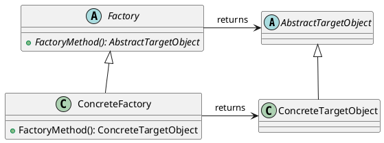

# Factory Method

The Factory Method pattern provides a flexible and extensible approach to object creation, allowing the separation of object creation logic from the client code and enabling the addition of new object types without modifying existing code.

- An interface or abstract class represents the object to be created (**Target Object**), which has multiple concrete implementations.
- An abstract object or interface, known as a **Creator or Factory**, returns an abstract version of the Target Object.
- Each concrete implementation of the **Target Object** has a corresponding concrete implementation of the **Factory**.
- To obtain a specific implementation of the **Target Object**, a specific implementation of the **Factory** is initialized, and the creation method is called on it.

## Benefits

1. **Single Responsibility Principle**: The Factory Method pattern enforces the single responsibility principle by separating conditional logic from the implementation of the logic inside each condition.

   - This separation makes the code more maintainable and allows for easier writing of automated tests.
   - Instead of complex and barely readable tests assessing intricate conditional logic, simple scenarios can be used to verify that the correct implementations of Target Object and Factory are picked up for each condition.
   - Separate sets of scenarios can be applied to each Target Object and Factory implementation.

2. **Reusability**: The Factory Method pattern allows a particular condition to be executed once.
   - Since all implementations of Target Object use a common abstraction, a concrete implementation can be created once and reused throughout the code.

## Caveats

1. **Questioning the Need for a Factory**: If there is only a single Factory Method object in the Creator that returns only one type of concrete implementation of Target Object, the benefits of using a Creator may be limited.

   - In such cases, one might consider conditionally selecting a concrete implementation of the Target Object directly, potentially achieving similar benefits with less complexity.

2. **Complexity**: The benefits of the Factory Method pattern become more apparent when there are multiple Factory Method objects in the Creator, and multiple related objects can be returned.
   - Using the Factory Method pattern in this way transforms it into another design pattern known as the Abstract Factory pattern.

In conclusion, the Factory Method pattern offers benefits such as adherence to the single responsibility principle, improved testability, and reusability. However, it's essential to assess the complexity and the specific use case to determine if the pattern provides significant advantages over alternative approaches.

[Example](../../Examples/Creational/CreationalDesignPatterns/Program.cs)
