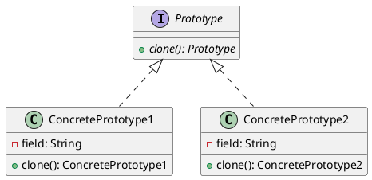
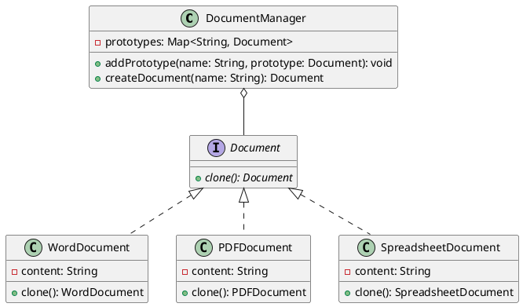

# Prototype Design Pattern

The Prototype design pattern is a creational pattern that allows objects to be cloned, creating new instances with the same properties as the original instance. This pattern is useful when the process of creating an object is costly or complex. Instead of creating a new object from scratch, you can make a copy of an existing object.



## Benefits

1. **Avoids Costly Creation**: Reduces the cost of creating new objects by cloning existing ones.
   * Cloning can be faster than creating a new object from scratch.
   * Useful when object creation is resource-intensive.

2. **Simplifies Object Creation**: Simplifies the creation process of objects that require complex initialization.
   * Allows for easy replication of objects with complex configurations.
   * Reduces the chances of errors in object creation.

3. **Dynamic Object Creation**: Allows dynamic creation of objects at runtime.
   * Objects can be cloned based on the current state.
   * Enhances flexibility and adaptability of the system.

4. **Reduces Subclassing**: Reduces the need for subclassing to create objects.
   * Different configurations can be achieved through cloning rather than inheritance.
   * Simplifies the class hierarchy.

## Caveats

1. **Complex Clone Method**: The clone method can be tricky if objects have complex structures or circular references.
   * Proper handling of deep and shallow copying is required.
   * Can lead to subtle bugs if not implemented correctly.

2. **Memory Management**: Cloning can lead to increased memory usage.
   * Cloning creates a new instance, which can be memory-intensive.
   * Efficient memory management techniques should be employed.

3. **State Dependency**: Cloned objects depend on the state of the original object.
   * Any changes to the original object after cloning do not affect the clone.
   * Care must be taken to handle state dependencies appropriately.

## When to Use

The Prototype pattern is most beneficial in the following scenarios:

1. **Costly Object Creation**: When creating new objects is costly or resource-intensive.
   * Cloning can provide a more efficient way to create new objects.

2. **Complex Object Initialization**: When objects require complex initialization.
   * Cloning simplifies the process by copying an existing object.

3. **Multiple Object Configurations**: When you need multiple configurations of an object.
   * Different prototypes can be created and cloned as needed.

4. **Dynamic Object Creation**: When objects need to be created dynamically at runtime.
   * Cloning allows for flexible and adaptive object creation.

## Example

Let's consider an example where we have a document management system that handles different types of documents (e.g., Word, PDF, Spreadsheet). Instead of creating new documents from scratch, we can clone existing documents.



In this example:

1. **Document Interface**: Declares the `clone` method for cloning objects.
2. **WordDocument, PDFDocument, SpreadsheetDocument**: Concrete prototypes that implement the `Document` interface.
3. **DocumentManager**: Manages the prototypes and creates new document objects by cloning existing ones.

```cs
// Usage example
class Program
{
    static void Main(string[] args)
    {
        DocumentManager documentManager = new DocumentManager();

        // Create prototypes
        WordDocument wordPrototype = new WordDocument("Word document content");
        PDFDocument pdfPrototype = new PDFDocument("PDF document content");
        SpreadsheetDocument spreadsheetPrototype = new SpreadsheetDocument("Spreadsheet document content");

        // Add prototypes to the document manager
        documentManager.AddPrototype("Word", wordPrototype);
        documentManager.AddPrototype("PDF", pdfPrototype);
        documentManager.AddPrototype("Spreadsheet", spreadsheetPrototype);

        // Create documents using the prototypes
        IDocument wordDocument = documentManager.CreateDocument("Word");
        IDocument pdfDocument = documentManager.CreateDocument("PDF");
        IDocument spreadsheetDocument = documentManager.CreateDocument("Spreadsheet");

        // Use the created documents
        // ...
    }
}
```

This code example shows how the Prototype pattern allows us to create new document objects by cloning existing prototypes, without explicitly specifying their concrete classes. The DocumentManager acts as a central repository for the prototypes and provides a simple interface to create new documents based on the registered prototypes.
