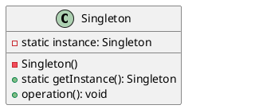

# Singleton Design Pattern

The Singleton design pattern is a creational pattern that ensures a class has only one instance and provides a global point of access to that instance. This pattern is useful when exactly one object is needed to coordinate actions across the system.



## Benefits

1. **Controlled Access**: Ensures controlled access to the single instance.
   * Provides a single point of access to the instance.
   * Prevents multiple instances from being created.

2. **Reduced Memory Usage**: Reduces memory usage by limiting the number of instances.
   * Only one instance is created, reducing the memory footprint.

3. **Global Access**: Provides a global point of access to the instance.
   * The instance can be accessed globally throughout the application.

4. **Lazy Initialization**: Can implement lazy initialization to create the instance only when it is needed.
   * Delays the creation of the instance until it is first accessed.

## Caveats

1. **Global State**: Introduces a global state in the application.
   * Can make the system less modular and harder to test.
   * May lead to issues with concurrency and synchronization.

2. **Concurrency Issues**: Can lead to concurrency issues in a multi-threaded environment.
   * Proper synchronization is required to ensure thread safety.
   * Double-checked locking or other synchronization mechanisms may be needed.

3. **Testing Difficulty**: Can make unit testing difficult.
   * Mocking or replacing the singleton instance in tests can be challenging.
   * May require additional setup for testing.

## When to Use

The Singleton pattern is most beneficial in the following scenarios:

1. **Single Instance Requirement**: When exactly one instance of a class is required.
   * Ensures that only one instance is created and used.

2. **Global Access Needed**: When a global point of access is needed.
   * Provides a single access point to the instance throughout the application.

3. **Resource Management**: When managing a shared resource.
   * Ensures controlled access to the resource.

4. **Configuration Management**: When managing configuration settings.
   * Provides a centralized and consistent access point for configuration.

## Example

Let's consider an example where we have a logging system that needs to ensure only one instance of the logger is created.


1. **Logger Class**: Defines the singleton instance using the **new** method to control instance creation.
2. **Log Method**: Provides a method to log messages.
3. **Client Code**: Demonstrates the use of the singleton logger instance.

>**Thread-Safe Implementation**
For a thread-safe implementation in a multi-threaded environment, you can use a locking mechanism.
[Implementing the Singleton Pattern in C#](https://www.jonskeet.uk/csharp/singleton.html).

Here's an example of how the Logger singleton can be used in client code:

```cs
class Program
{
    static void Main(string[] args)
    {
        Logger.Instance.Log("Application started.");
        // Do some work...
        Logger.Instance.Log("Application finished.");
    }
}
```

In this example, the client code accesses the single instance of Logger using the Instance property and calls the Log method to log messages.

The implementation is thread-safe because the instance is created lazily and only once, thanks to the static readonly field. This ensures that even in a multi-threaded environment, only one instance of Logger will be created.

Note that this implementation doesn't use explicit locking, as the article mentions that the combination of static readonly and a private constructor is sufficient for thread-safety in most cases. However, if you have specific requirements or if you need to perform additional thread-safe operations, you can modify the implementation to include locking mechanisms as described in the second version of the article.
