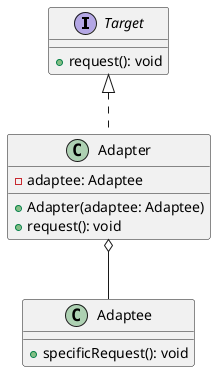
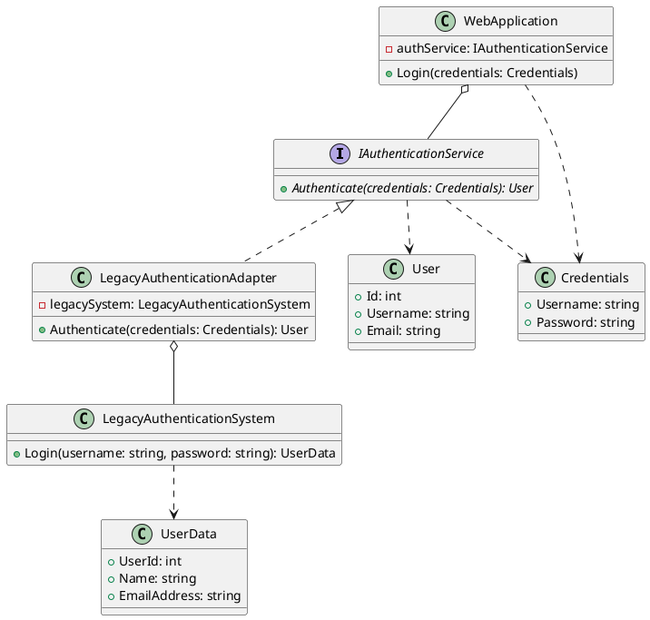

# Adapter Design Pattern

The Adapter design pattern is a structural pattern that allows objects with incompatible interfaces to work together. It acts as a bridge between two incompatible interfaces by converting the interface of a class into another interface that a client expects.



## Benefits

1. **Increased Reusability**: Allows the reuse of existing classes.
   * Enables classes with incompatible interfaces to work together.
   * Promotes the reuse of legacy code.

2. **Improved Flexibility**: Enhances the flexibility of the code.
   * Allows the integration of new components without changing existing code.
   * Facilitates the use of third-party libraries.

3. **Simplifies Code**: Simplifies the client code by providing a consistent interface.
   * Provides a uniform interface to clients.
   * Hides the complexity of the adaptee.

## Caveats

1. **Increased Complexity**: Can add complexity to the codebase.
   * Introduces additional classes and interfaces.
   * May lead to more complex class hierarchies.

2. **Performance Overhead**: Can introduce a performance overhead.
   * The adapter adds an extra layer of indirection.
   * May affect the performance of time-critical applications.

3. **Limited Functionality**: May not support all functionalities of the adaptee.
   * The adapter may expose only a subset of the adaptee's functionalities.
   * May require multiple adapters for comprehensive functionality.

## When to Use

The Adapter pattern is most beneficial in the following scenarios:

1. **Incompatible Interfaces**: When you need to integrate classes with incompatible interfaces.
   * Allows different classes to work together seamlessly.

2. **Legacy Code Integration**: When you need to integrate legacy code with a new system.
   * Enables the reuse of existing code without modification.

3. **Third-Party Libraries**: When you need to use third-party libraries with incompatible interfaces.
   * Facilitates the integration of external components.

4. **Consistent Interfaces**: When you need to provide a consistent interface to clients.
   * Simplifies the client code by providing a uniform interface.

## Example

Suppose we have a legacy user authentication system that uses a different interface than the one expected by our modern web application framework. We can use the Adapter pattern to integrate the legacy authentication system into our web application without modifying the existing codebase.



1. **IAuthenticationService**: An interface that defines the contract for the authentication service expected by the web application framework. It has a method Authenticate() that takes Credentials and returns a User object.
2. **LegacyAuthenticationSystem**: A class representing the legacy authentication system. It has a method Login() that takes a username and password and returns a UserData object.
LegacyAuthenticationAdapter: An adapter class that implements the IAuthenticationService interface and adapts the LegacyAuthenticationSystem to work with the web application framework. It internally holds an instance of LegacyAuthenticationSystem. The Authenticate() method of the adapter converts the Credentials object to the format expected by the legacy system, calls the Login() method, and then converts the returned UserData object to a User object.
3. **WebApplication**: A class representing the web application that relies on the IAuthenticationService for user authentication. It has a Login() method that takes Credentials and delegates the authentication to the IAuthenticationService.
4. **Credentials**: A class representing the user credentials, containing the username and password.
5. **User**: A class representing the authenticated user, containing user details such as ID, username, and email.
6. **UserData**: A class representing the user data returned by the legacy authentication system, containing user details in a different format.

This example demonstrates how the Adapter pattern can be applied in a web application framework to integrate legacy components, promoting code reuse, maintainability, and extensibility:

```cs
// Create an instance of the legacy authentication system
LegacyAuthenticationSystem legacySystem = new LegacyAuthenticationSystem();

// Create an instance of the adapter
IAuthenticationService authAdapter = new LegacyAuthenticationAdapter(legacySystem);

// Set the authentication service in the web application
WebApplication app = new WebApplication();
app.SetAuthenticationService(authAdapter);

// Perform user login
Credentials credentials = new Credentials
{
    Username = "john.doe",
    Password = "password123"
};

app.Login(credentials);
```