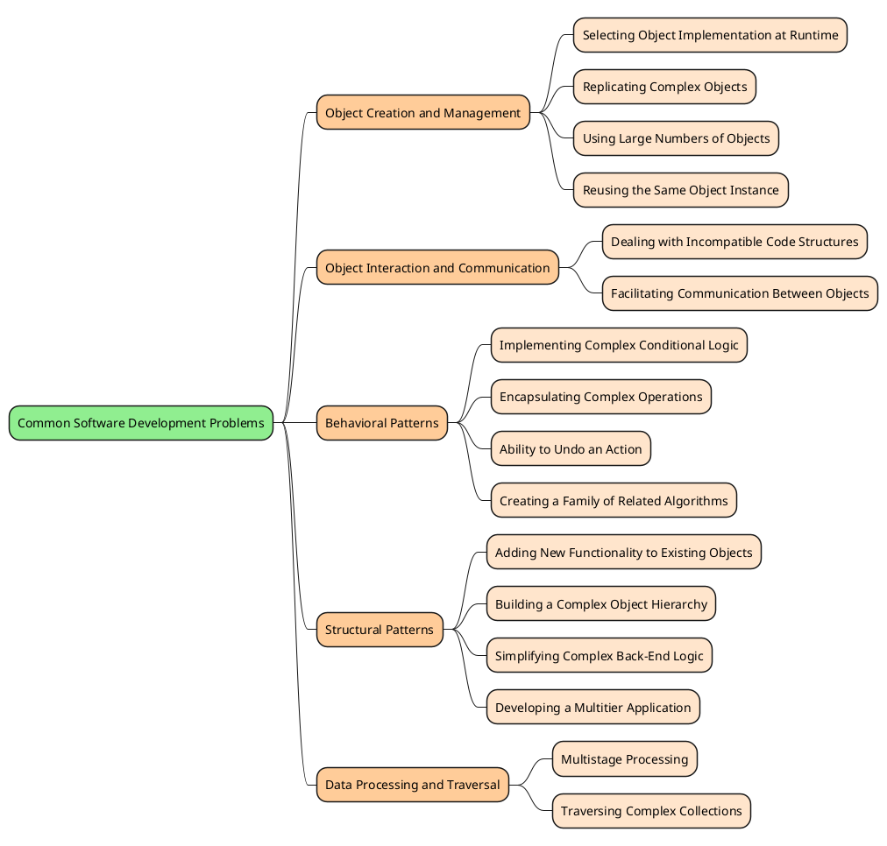

# Design Patterns for Common Software Problems

This repository serves as both a learning guide and a reference source for design patterns. It helps developers understand design patterns in the context of common software problems and provides a quick way to find suitable solutions when faced with similar challenges.

## 📑 Table of Contents

- [Mindmap](#mindmap)
- [Applications of Design Patterns](#applications-of-design-patterns)
  - [Object Creation and Management](#object-creation-and-management)
  - [Object Interaction and Communication](#object-interaction-and-communication)
  - [Behavioral Patterns](#behavioral-patterns)
  - [Structural Patterns](#structural-patterns)
- [Quick Reference](#quick-reference)
  - [Problems Solved by Design Patterns](#problems-solved-by-design-patterns)
- [Contributing](#contributing)
- [Resources](#resources)

## Mindmap

The following mindmap provides an overview of common software development problems and their corresponding design pattern solutions:

## Applications of Design Patterns

Here's a categorized list of these problems and their corresponding design pattern solutions:

### Object Creation and Management

- [Selecting Object Implementation at Runtime](Applications_of_design_patterns/Selecting_Object_Implementation_at_Runtime.md)
- [Replicating Complex Objects](Applications_of_design_patterns/Replicating_Complex_Objects.md)
- [Using Large Numbers of Objects](Applications_of_design_patterns/Using_Large_Numbers_of_Objects.md)
- [Reusing the Same Object Instance](Applications_of_design_patterns/Reusing_the_Same_Object_Instance.md)

### Object Interaction and Communication

- [Dealing with Incompatible Code Structures](Applications_of_design_patterns/Dealing_with_Incompatible_Code_Structures.md)
- [Facilitating Communication Between Objects](Applications_of_design_patterns/Facilitating_Communication_Between_Objects.md)

### Behavioral Patterns

- [Implementing Complex Conditional Logic](Applications_of_design_patterns/Implementing_Complex_Conditional_Logic.md)
- [Encapsulating Complex Operations](Applications_of_design_patterns/Encapsulating_Complex_Operations.md)
- [Ability to Undo an Action](Applications_of_design_patterns/Ability_to_Undo_an_Action.md)
- [Creating a Family of Related Algorithms](Applications_of_design_patterns/Creating_a_Family_of_Related_Algorithms.md)

### Structural Patterns

- [Adding New Functionality to Existing Objects](Applications_of_design_patterns/Adding_New_Functionality_to_Existing_Objects.md)
- [Building a Complex Object Hierarchy](Applications_of_design_patterns/Building_a_Complex_Object_Hierarchy.md)
- [Simplifying Complex Back-End Logic](Applications_of_design_patterns/Simplifying_Complex_Back-End_Logic.md)
- [Developing a Multitier Application](Applications_of_design_patterns/Developing_a_Multitier_Application.md)

## 🔍 Quick Reference

### Problems Solved by Design Patterns

1. When you don't know what object implementations you'll need ahead of time:

   - **Factory Method**: If an object needs to be instantiated in one go.
   - **Abstract Factory**: If multiple objects need to be instantiated in one go.
   - **Builder**: If an object needs to be built step by step.

2. When you're making several exact copies of a complex object:

   - **Prototype**: It was specifically invented for easy cloning of objects.

3. When you're using many instances of an object while keeping code running smoothly:

   - **Object Pool**: It facilitates the reuse of pre-instantiated objects.
   - **Flyweight**: It allows you to have a very large number of similar objects without much performance penalty, but makes the code complicated.
   - **Prototype**: It can be combined with the Object Pool pattern to make the initial creation of the objects easier.

4. When you're using the same single instance of an object throughout the application:

   - **Singleton**: It forces a single instance of an object of a particular type to be used throughout the application.

5. When third-party components aren't directly compatible with your code:

   - **Adapter**: It uses an intermediate translation object to convert between two different API formats.

6. When you're adding new functionality to existing objects that can't be modified:

   - **Decorator**: It adds new capabilities to an existing object by overriding its methods.

7. When accessing complex back-end logic from the presentation layer:

   - **Facade**: It simplifies the access interface to the complex logic.
   - **Proxy**: It caches the result of expensive operations.

8. When user interface and business logic are developed separately:

   - **Bridge**: It's suitable when the frontend and backend can be designed together up front.
   - **Facade**: It's suitable when the backend is hosted by a third party or can't be designed alongside the user interface up front.
   - **Proxy**: It prevents services outage during back-end redeployment.

9. When building a complex object hierarchy:

   - **Composite**: It was invented for creating complex tree-like structures of objects that can have arbitrary capabilities.

10. When implementing complex conditional logic:

    - **Strategy**: It facilitates a conditional one-off action.
    - **Factory Method**: It facilitates conditional creation of a long-lived object.
    - **Abstract Factory**: It facilitates conditional creation of multiple long-lived objects.

11. When multiple object instances of different types need to be able to communicate with each other:

    - **Mediator**: It's easier to implement when communication logic between different objects doesn't expect to be changed.
    - **Observer**: It's easier to implement when communication between different objects is expected to change at runtime or during configuration.

12. When multiple stages of processing are needed:

    - **Chain of Responsibility**: It's suitable in scenarios where processing steps are predefined and a one-off logical flow is executed.
    - **Builder**: It's suitable in scenarios where the order of processing stages can be arbitrary and a reusable object is being built.

13. When the system is controlled by complex combinations of inputs:

    - **Command**: It keeps the logic for a complex operation in a single place.

14. When the ability to undo an action that has been applied is required:

    - **Memento**: It allows you to store the exact snapshots of the state.
    - **Command**: It allows you to revert an action by performing an opposite action.

15. When the ability to traverse a collection without knowing its underlying structure is required:

    - **Iterator**: It performs a traversal of any complex data structure internally while exposing a simple interface externally.

16. When creating a family of related algorithms:
    - **Template Method**: It's easy to implement, but might violate the Liskov substitution principle.
    - **Visitor**: It allows you to separate an object from its behavior and add many different types of behavior to the objects.
    - **State**: It allows you to change the behavior of an entire object in one go by changing the mode (state) that the object is in.
    - **Strategy**: It's suitable when algorithms are selected by conditional logic.

> Remember that design patterns are not a silver bullet and should be applied judiciously. Consider the specific requirements, constraints, and context of your problem before deciding on a design pattern. The goal is to use design patterns to improve code reusability, flexibility, and maintainability while solving the problem at hand effectively.

## 🤝 Contributing

Contributions to this repository are welcome! If you have any new design patterns to add, examples to provide, or improvements to make, please feel free to submit a pull request. Let's collaborate and make this repository a valuable resource for the developer community.

## 🔗 Resources

- **[Design Patterns: Elements of Reusable Object-Oriented Software](https://www.amazon.com/Design-Patterns-Elements-Reusable-Object-Oriented/dp/0201633612)**

- **[Refactoring Guru - Design Patterns](https://refactoring.guru/design-patterns)**

- **[Source Making - Design Patterns](https://sourcemaking.com/design_patterns)**

- **[MSDN: Design Patterns: Solidify Your C# Application Architecture with Design Patterns](https://learn.microsoft.com/en-us/archive/msdn-magazine/2001/july/design-patterns-solidify-your-csharp-application-architecture-with-design-patterns)**

- **[Educative: Design Patterns with C#](https://www.educative.io/courses/the-easiest-way-to-learn-design-patterns-in-csharp)**
